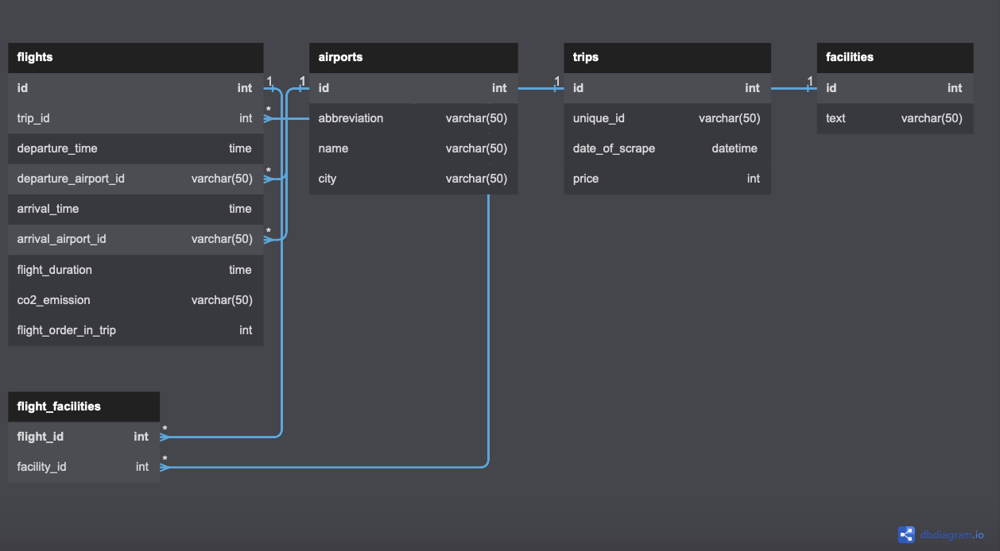

# Google Flight Scrapper
### Data mining project for ITC

</p>


**********MILESTONE 1********** 


This program parses Googleflight, a research engine for booking flight. 
<br>Parsing page, getting important information about flighs according to a specific research. 
Program made by Oleg Podlipalin and Ruben Adhoute during ITC October 2022 Data Science cohort.

### How to run it
- Download __*.zip__ file
- Unzip it at any suitable folder
- Install all libs from __requirements.txt__
- Fill in the _CHOOSE_YOUR_OPTION_ parametr (destination)
- Run __data_extracting.py__
- Have a cup of cofee
- That's all
```

```


### Functionality of functions
Functions are broken down to files. Each file combines logically connected functionality.

| *File*             | *Function*                                  | *What do and return*                                                                                       |
|--------------------|---------------------------------------------|------------------------------------------------------------------------------------------------------------|
| data_extracting.py | main                                        | Acts as an orchestrator to program functions. Calls different functions to generate driver and scrap data. |
| scrapping.py       | scrape_data                                 | Activate driver and running it on the web page                                                             |
| driver_action.py   | click_object_class_name                     | tell driver to execute the following - click on class object                                               |
| driver_action.py   | click_object_xpath                          | tell driver to execute the following - click on xpath object                                               |
| driver_action.py   | extend_all                                  | tell driver to execute the following - extend object                                                       |
| driver_action.py   | xpath_build                                 | tell driver to execute the following - build xpath from object                                             |
| driver_start.py    | start_driver                                | initialize the driver given a specific URL                                                                 |
| create_DB   | create_DB                                   | Checks if DB exists, if not creates database                                                                                                                                        |
| create_DB   | create_db_tables                            | Creates db tables
| write_to_db | write_data_to_db                          |  Preliminary Parsing  from the website data                                                                                                                                                    |
| write_to_db | write_flight_to_db                      |        Write flight details into DB table flight

| write_to_db | link_facility_to_flight                      |        Link facility to flight
 
| write_to_db | write_trips_to_db                      |   Write trips details into DB Table trips
| write_to_db | write_facilities_to_db                      |   Write facilities details into DB Table facilities
     

**********MILESTONE 2********** 

### DB info
#### DB ERD
<p align="left">
</p>

#### Table "flights"
| column_name        | Description                                      |
|--------------------|--------------------------------------------------|
| id                 | Flight id (Primary key)                           |
| trip_id            | Trip id                                            |
| departure_time     | Departure time of the flight                       |
| departure_airport_id | Departure airport id                             |
| arrival_time         | Arrival time of the flight                       |
| arrival_airport_id   | Arrival airport id                               |
| flight_duration     | Flight duration.                                  |
| c02_emission        | co2 emission of the flight.                       |
| flight_order_in_trip | Number of flight in reference to trip  |


#### Table "facilities"
| column_name      | Description                        |
|------------------|------------------------------------|
| id               | ID of flight facility (Primary key) |
| text             | Additional info regarding facilities|

#### Table "flight_facilities"
| column_name    | Description                        |
|----------------|------------------------------------|
| flight_ id             | Flight id                  |
| facility_id       | ID of flight facility           |

#### Table "airports"
| column_name        | Description                                      |
|--------------------|--------------------------------------------------|
| id                  | Airport id (Primary key)                        |
| abbrevation         | Abbreviated name of the airport                 |
| name                | Name of airport                                 |
| city                | City of the airport                             |


#### Table "trips"
| column_name    | Description                                      |
|----------------|--------------------------------------------------|
| id             | Trip id (Primary key)                           |
| unique_id      | Trip id                                            |
| date_of_scrape | Date of the scrapping                            |
| price          | Price of the trip                              |

